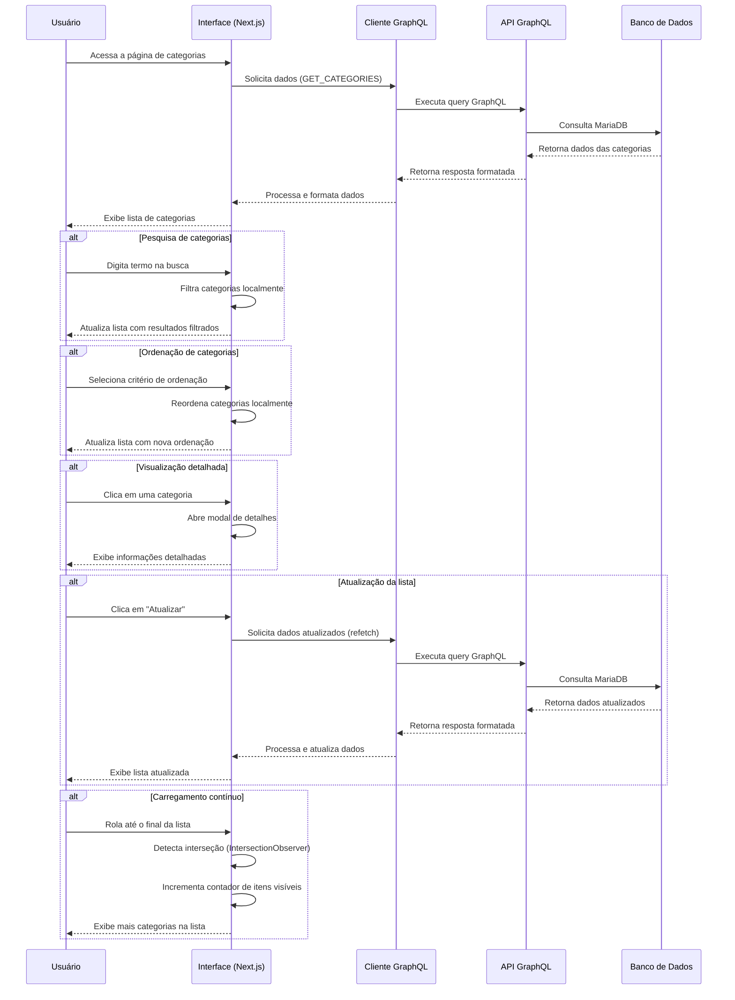

# Fluxo de Consulta de Categorias

Este documento detalha o fluxo de consulta e visualização de categorias na aplicação Beaver, incluindo a interação entre o frontend e o backend, bem como as diferentes formas de visualização e filtragem.

## Diagrama de Fluxo



## Fluxo Detalhado

### 1. Inicialização e Carregamento de Dados

1. **Inicialização da Interface**
   - O componente `CategoriesPage` é carregado
   - Estados iniciais são configurados:
     - `searchTerm`: termo de busca (vazio inicialmente)
     - `sortBy`: campo para ordenação ('name' por padrão)
     - `sortDirection`: direção da ordenação ('asc' por padrão)
     - `visibleCount`: número de itens visíveis inicialmente (12)
     - `hasMore`: indicador de mais itens disponíveis (true inicialmente)

2. **Solicitação de Dados**
   - A consulta `GET_CATEGORIES` é executada via Apollo Client
   - Configuração da política de busca (`fetchPolicy: 'network-only'`) para garantir dados atualizados
   - Tratamento de erros implementado via `onError`

3. **Processamento no Backend**
   - O resolver `categories` no `categoryResolvers.ts` processa a requisição
   - Executa consulta ao MariaDB via Prisma (`ctx.prisma.category.findMany`)
   - Ordenação básica aplicada (`orderBy: { name: 'asc' }`)
   - Dados são retornados ao cliente

4. **Processamento dos Dados Recebidos**
   - Os dados são formatados no frontend:
     - Datas são convertidas para objetos Date
     - Contagem de componentes associados é calculada

### 2. Visualização e Interação com a Lista

1. **Exibição da Lista**
   - Categorias são renderizadas em cards no formato de grid
   - Layout responsivo com 1-3 colunas dependendo do tamanho da tela
   - Cada card exibe:
     - Nome da categoria
     - Imagem (se disponível) ou ícone padrão
     - Descrição truncada
     - Contagem de componentes associados
     - Data de criação formatada

2. **Filtragem por Busca**
   - O usuário digita um termo na caixa de busca
   - Filtragem é aplicada em tempo real (sem submissão de formulário)
   - A função `filteredCategories` filtra por nome ou descrição
   - Correspondência é case-insensitive (minúsculas/maiúsculas ignoradas)
   - A lista é atualizada dinamicamente conforme o usuário digita

3. **Ordenação da Lista**
   - O usuário pode ordenar por:
     - Nome (alfabeticamente)
     - Data de criação (cronologicamente)
   - A direção pode ser ascendente ou descendente
   - A função `sortCategories` aplica a ordenação escolhida
   - Indicadores visuais mostram o campo e direção de ordenação atuais
   - Ordenação é mantida durante a sessão

4. **Carregamento Contínuo (Infinite Scroll)**
   - Inicialmente são exibidas 12 categorias
   - Um `IntersectionObserver` monitora o último item visível
   - Quando o usuário rola até o final da lista, mais 8 itens são carregados
   - Um indicador de carregamento é exibido durante o processo
   - O carregamento continua até que todas as categorias sejam exibidas

5. **Atualização da Lista**
   - O usuário pode atualizar a lista usando o botão com ícone `RefreshCw`
   - A função `refetch()` do Apollo Client recarrega os dados da API
   - Estado de carregamento é exibido durante a atualização

### 3. Visualização Detalhada de uma Categoria

1. **Abertura do Modal de Detalhes**
   - O usuário clica em um card de categoria
   - O estado `currentCategory` é atualizado com a categoria selecionada
   - O estado `showDetails` é definido como `true`
   - Um modal é exibido com informações detalhadas

2. **Exibição de Detalhes**
   - O modal exibe:
     - Nome da categoria
     - Imagem em tamanho maior (se disponível)
     - Descrição completa
     - Informações adicionais:
       - ID da categoria
       - Data de criação formatada
       - Número de componentes associados
     - Botões para ações (Editar e Excluir)

3. **Fechamento do Modal**
   - O usuário pode fechar o modal clicando no botão ✕
   - O estado `showDetails` é definido como `false`
   - Retorno à visualização da lista

## Tratamento de Estados Especiais

### 1. Estado de Carregamento

- Durante o carregamento inicial, uma mensagem "Carregando categorias..." é exibida
- Centralizada na tela com tamanho e espaçamento adequados
- Implementada com verificação condicional `loading && !data`

### 2. Estado de Erro

- Em caso de falha na consulta, uma mensagem de erro é exibida
- Informações específicas sobre o erro são mostradas
- Um botão "Tentar novamente" permite refazer a consulta
- Implementado com verificação condicional `error`
- Tratamento especial para erro de conexão "Failed to fetch"

### 3. Lista Vazia

- Quando não há categorias ou a filtragem não retorna resultados
- Uma mensagem "Nenhuma categoria encontrada" é exibida
- Centralizada com estilo adequado para orientação do usuário

## Componentes Envolvidos

### Frontend (Next.js/React)
- **src/app/categories/page.tsx**: Componente principal com toda a lógica de consulta e visualização
- **src/lib/graphql.ts**: Definição da query `GET_CATEGORIES`
- **components/ui**: Componentes de UI reutilizáveis (Button, Input, Dialog, etc.)

### Backend (Apollo Server/Pothos GraphQL/Prisma)
- **api/src/resolvers/categoryResolvers.ts**: Resolver para a query `categories`
- **api/src/prisma.ts**: Cliente Prisma para acesso ao banco de dados
- **api/prisma/schema.prisma**: Definição do modelo `Category`

## Consultas GraphQL

```graphql
# Query para listar categorias
query GetCategories {
  categories {
    id
    name
    description
    image
    createdAt
    components {
      id
    }
  }
}
```

## Otimizações e Considerações de Performance

1. **Filtragem e Ordenação no Cliente**
   - Realizadas no frontend para reduzir consultas ao servidor
   - Adequadas para conjuntos de dados pequenos a médios
   - Futuras melhorias podem incluir filtragem no servidor para grandes volumes

2. **Carregamento Contínuo**
   - Implementação de "infinite scroll" para carregar dados incrementalmente
   - Reduz o tempo de carregamento inicial da página
   - Melhora a experiência do usuário com grandes conjuntos de dados

3. **Imagens Otimizadas**
   - Imagens são armazenadas como BLOB no banco
   - Transmitidas como base64 pelo GraphQL
   - Exibidas em tamanho reduzido na lista e tamanho maior nos detalhes

4. **Cache do Apollo Client**
   - Utilização do cache para consultas recentes
   - Política `network-only` para garantir dados atualizados na primeira carga
   - Controle manual de atualização do cache após mutações

## Notas de Implementação

- A estrutura implementa o padrão de "mestre-detalhe" para categorias
- A interface prioriza a visualização rápida com cards compactos
- A opção de detalhes permite visualização completa das informações
- O sistema é responsivo e adapta-se a diferentes tamanhos de tela
- A implementação de carregamento contínuo melhora a performance percebida 