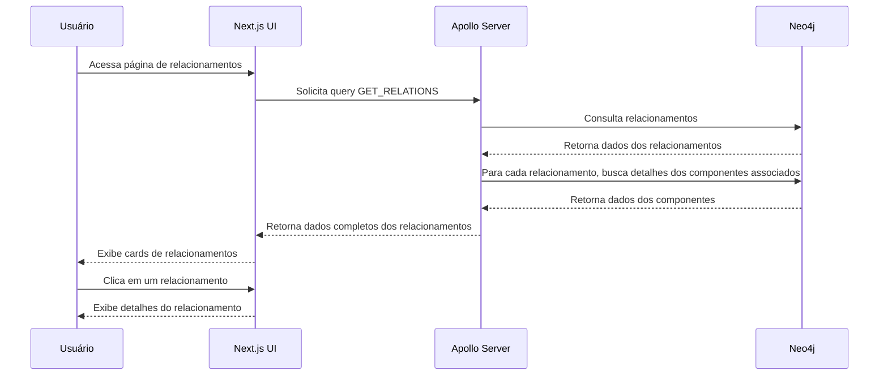

# Fluxo de Consulta de Relacionamentos

Este documento descreve o fluxo completo de consulta de relacionamentos no sistema Beaver, abordando desde a solicitação do cliente até a exibição dos dados na interface do usuário.

## Visão Geral

O processo de consulta de relacionamentos no Beaver envolve os seguintes componentes:

1. **Frontend (Next.js)**: Interface que exibe os dados e permite interação
2. **API GraphQL (Apollo Server)**: Processa as requisições e retorna dados estruturados
3. **Neo4j**: Banco de dados de grafos onde os relacionamentos e componentes são armazenados



## Detalhamento das Etapas

### 1. Solicitação do Cliente

- O usuário acessa a página de relacionamentos em `/relationships`
- O componente React `RelationshipsPage` é carregado
- O hook `useQuery` do Apollo Client é usado para buscar os dados:

```typescript
const { loading, error, data, refetch } = useQuery(GET_RELATIONS, {
  fetchPolicy: 'network-only',
  onError: (error) => {
    console.error('Erro na consulta GraphQL:', error);
  }
});
```

### 2. Definição da Query GraphQL

- A query GraphQL `GET_RELATIONS` é definida para buscar todos os relacionamentos:

```graphql
query GetRelations {
  relations {
    id
    sourceId
    targetId
    type
    properties
    source {
      id
      name
      status
    }
    target {
      id
      name
      status
    }
    createdAt
    updatedAt
  }
}
```

### 3. Processamento no Servidor

- O resolver `relations` no backend processa a requisição:

```typescript
builder.queryField('relations', (t) =>
  t.field({
    type: [RelationType],
    resolve: async () => {
      try {
        const result = await neo4jClient.getRelations();
        return result;
      } catch (error) {
        logger.error('Erro ao buscar relações:', error);
        return [];
      }
    },
  })
);
```

### 4. Busca de Relacionamentos no Neo4j

- O cliente Neo4j busca todos os relacionamentos no banco de dados:

```typescript
async getRelations(): Promise<IRelation[]> {
  const session = this.driver.session();
  try {
    const result = await session.run(`
      MATCH (source:Component)-[r]->(target:Component)
      RETURN 
        toString(id(r)) AS id, 
        type(r) AS type, 
        source.id AS sourceId, 
        target.id AS targetId,
        r.properties AS properties,
        COALESCE(r.createdAt, toString(datetime())) AS createdAt,
        COALESCE(r.updatedAt, toString(datetime())) AS updatedAt
    `);

    return result.records.map(record => {
      const idValue = record.get('id');
      return {
        id: idValue,
        type: record.get('type'),
        sourceId: typeof record.get('sourceId') === 'number' ? record.get('sourceId') : parseInt(record.get('sourceId')),
        targetId: typeof record.get('targetId') === 'number' ? record.get('targetId') : parseInt(record.get('targetId')),
        properties: record.get('properties') || {},
        createdAt: new Date(record.get('createdAt')),
        updatedAt: new Date(record.get('updatedAt'))
      };
    });
  } finally {
    await session.close();
  }
}
```

### 5. Resolução de Campos Adicionais

- Para cada relacionamento, os campos `source` e `target` são resolvidos através de consultas adicionais ao Neo4j:

```typescript
source: t.field({
  type: 'Component',
  nullable: true,
  resolve: async (relation) => {
    // Buscar informações do componente de origem diretamente do Neo4j
    try {
      const result = await neo4jClient.run(`
        MATCH (c:Component {id: $id})
        RETURN c.id as id, c.name as name, c.status as status, c.description as description
      `, { id: relation.sourceId });

      if (result.records && result.records.length > 0) {
        const record = result.records[0];
        return {
          id: typeof record.get('id') === 'number' ? record.get('id') : parseInt(record.get('id')),
          name: record.get('name'),
          status: record.get('status'),
          description: record.get('description') || ''
        };
      }
      return null;
    } catch (error) {
      logger.error(`Erro ao buscar componente de origem (ID: ${relation.sourceId}) no Neo4j:`, error);
      return null;
    }
  },
}),
```

- Esta consulta ao Neo4j recupera os detalhes dos componentes de origem e destino de cada relacionamento

### 6. Resposta ao Frontend

- O resolver retorna os dados completos dos relacionamentos para o cliente
- O Apollo Client no frontend recebe a resposta da query
- O hook `useQuery` em `page.tsx` atualiza o estado com os dados recebidos

```typescript
const { loading, error, data, refetch } = useQuery(GET_RELATIONS, {
  fetchPolicy: 'network-only',
  onError: (error) => {
    console.error('Erro na consulta GraphQL:', error);
  }
});
```

### 7. Processamento e Exibição na UI

- Os dados dos relacionamentos são transformados para o formato esperado pela UI:
  ```typescript
  const relationships = data?.relations?.map((relation: any) => ({
    ...relation,
    created_at: new Date(relation.createdAt),
    updated_at: new Date(relation.updatedAt)
  })) || [];
  ```

- Os relacionamentos são filtrados com base na busca e filtros aplicados pelo usuário:
  ```typescript
  const filteredRelationships = relationships.filter((relationship: RelationType) => {
    const sourceNameMatch = relationship.source?.name.toLowerCase().includes(searchTerm.toLowerCase());
    const targetNameMatch = relationship.target?.name.toLowerCase().includes(searchTerm.toLowerCase());
    const typeMatch = relationship.type.toLowerCase().includes(searchTerm.toLowerCase());
    const descriptionMatch = relationship.properties?.description?.toLowerCase().includes(searchTerm.toLowerCase());
    
    const matchesSearch = sourceNameMatch || targetNameMatch || typeMatch || descriptionMatch;
    const matchesTypeFilter = typeFilter === 'all' || relationship.type === typeFilter;
    
    return matchesSearch && matchesTypeFilter;
  });
  ```

- A interface exibe os relacionamentos em forma de cards:
  ```jsx
  <div 
    key={relationship.id}
    className="bg-card rounded-lg border shadow-sm p-4 cursor-pointer hover:border-primary transition-colors h-[180px] flex flex-col"
    onClick={() => handleRelationshipClick(relationship)}
  >
    <div className="flex items-center justify-between mb-2">
      <h3 className="text-lg font-medium truncate max-w-[70%]">
        {relationship.source?.name || 'Desconhecido'}
      </h3>
    </div>
    <div className="flex items-center text-muted-foreground mb-4">
      <ArrowRight size={16} className="mx-1" />
      <div className="truncate max-w-[70%]">
        {relationship.target?.name || 'Desconhecido'}
      </div>
    </div>
    <span className="inline-block px-2 py-1 text-xs rounded-full bg-primary/10 text-primary">
      {relationship.type.replace(/_/g, ' ')}
    </span>
  </div>
  ```

## Exemplo de Consulta a um Relacionamento Específico

Quando o usuário seleciona um relacionamento específico, uma nova consulta é realizada:

```graphql
query GetRelation($id: String!) {
  relation(id: $id) {
    id
    sourceId
    targetId
    type
    properties
    source {
      id
      name
      status
    }
    target {
      id
      name
      status
    }
    createdAt
    updatedAt
  }
}
```

A consulta Cypher correspondente no Neo4j é:

```cypher
MATCH (source:Component)-[r]->(target:Component)
WHERE id(r) = $id
RETURN 
  id(r) as id, 
  type(r) as type, 
  source.id as sourceId, 
  target.id as targetId, 
  source.name as sourceName,
  target.name as targetName,
  properties(r) as properties,
  toString(datetime()) as createdAt,
  toString(datetime()) as updatedAt
```

## Particularidades do Fluxo de Consulta de Relacionamentos

O fluxo de consulta de relacionamentos tem as seguintes características:

1. Utiliza exclusivamente o Neo4j para todos os dados (relacionamentos e componentes)
2. Trata os relacionamentos como entidades existentes apenas no Neo4j, sem correspondência no MariaDB
3. Os dados dos componentes associados aos relacionamentos também são buscados diretamente do Neo4j

## Considerações sobre o Desempenho

- As consultas de relacionamentos são realizadas diretamente no Neo4j, que é otimizado para navegação em grafos
- Os dados dos componentes associados também são buscados do Neo4j, reduzindo a necessidade de consultas a múltiplos bancos
- O frontend implementa infinite scrolling para carregar relacionamentos em lotes, melhorando a performance para grandes conjuntos de dados
- A filtragem e ordenação são realizadas no cliente (frontend) após o carregamento dos dados, o que pode afetar o desempenho com grandes volumes de dados 