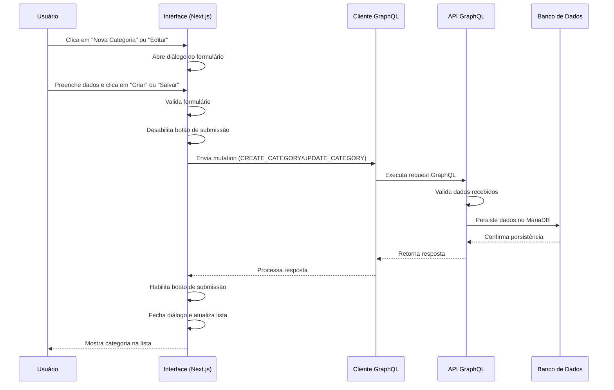

# Fluxo de Criação e Edição de Categorias

Este documento detalha o fluxo de criação e edição de categorias na aplicação Beaver, incluindo a interação entre o frontend e o backend.

## Diagrama de Fluxo



## Fluxo Detalhado

### 1. Inicialização da Interface

- O componente `CategoriesPage` é carregado e inicializa os estados necessários:
  - `isCreateDialogOpen`: controla a visibilidade do modal de criação
  - `isEditDialogOpen`: controla a visibilidade do modal de edição
  - `currentCategory`: armazena a categoria em edição quando aplicável

### 2. Carregamento de Dados

- Na inicialização, a consulta `GET_CATEGORIES` é executada para buscar categorias existentes
- Os dados recebidos são formatados, incluindo a contagem de componentes relacionados
- As categorias são exibidas em cards com scroll infinito

### 3. Fluxo de Criação

1. **Ação do Usuário**
   - O usuário clica no botão "Nova Categoria"
   - O estado `isCreateDialogOpen` é definido como `true`, exibindo o diálogo

2. **Preenchimento do Formulário**
   - O usuário preenche os campos obrigatórios:
     - Nome (obrigatório)
     - Descrição (obrigatório, limitado a 256 caracteres)
     - Imagem (opcional, PNG ou SVG, máx. 256x256px)

3. **Submissão do Formulário**
   - Ao clicar em "Criar Categoria":
     - Validação local do formulário é executada
     - O botão é desabilitado e exibe indicador de carregamento
     - O método `handleCreateSubmit` é chamado com os dados do formulário

4. **Processamento da Requisição**
   - A mutation `CREATE_CATEGORY` é executada com os dados do formulário
   - O cliente GraphQL envia a requisição para a API

5. **Processamento no Backend**
   - O resolver `createCategory` recebe a requisição
   - Valida os dados recebidos
   - Processa a imagem (converte de base64 para Buffer)
   - Cria o registro no banco de dados MariaDB
   - Retorna os dados da categoria criada

6. **Finalização no Frontend**
   - Após resposta bem-sucedida, o diálogo é fechado
   - A lista de categorias é atualizada com `refetch()`
   - O usuário vê a nova categoria na lista
   - Em caso de erro, uma mensagem é exibida e o botão de submissão é reativado

### 4. Fluxo de Edição

1. **Seleção da Categoria**
   - O usuário clica em uma categoria existente para ver detalhes
   - Clica no botão "Editar"
   - O estado `currentCategory` é definido com a categoria selecionada
   - O estado `isEditDialogOpen` é definido como `true`, exibindo o diálogo

2. **Preenchimento do Formulário**
   - O formulário é inicializado com os dados da categoria existente
   - O usuário modifica os campos desejados

3. **Submissão do Formulário**
   - Ao clicar em "Salvar Alterações":
     - Validação local do formulário é executada
     - O botão é desabilitado e exibe indicador de carregamento
     - O método `handleUpdateSubmit` é chamado com os dados atualizados

4. **Processamento da Requisição**
   - A mutation `UPDATE_CATEGORY` é executada com os dados atualizados e o ID da categoria
   - O cliente GraphQL envia a requisição para a API

5. **Processamento no Backend**
   - O resolver `updateCategory` recebe a requisição
   - Verifica se a categoria existe
   - Atualiza apenas os campos modificados
   - Retorna os dados da categoria atualizada

6. **Finalização no Frontend**
   - Após resposta bem-sucedida, o diálogo é fechado
   - A lista de categorias é atualizada com `refetch()`
   - Em caso de erro, uma mensagem é exibida e o botão de submissão é reativado

## Tratamento de Erros

- **Frontend**:
  - Validação de formulário local antes do envio
  - Feedback visual durante o processamento (botão desabilitado, indicador de carregamento)
  - Exibição de mensagens de erro em alertas
  - Resetamento do estado de submissão após completar ou falhar

- **Backend**:
  - Verificação do contexto e disponibilidade do cliente Prisma
  - Validação dos dados recebidos
  - Verificação de existência da categoria (para atualização)
  - Log detalhado de erros
  - Respostas de erro formatadas para o cliente GraphQL

## Componentes Envolvidos

### Frontend (Next.js/React)
- **src/app/categories/page.tsx**: Componente principal da página de categorias
- **src/app/categories/category-form.tsx**: Formulário para criação e edição
- **src/lib/graphql.ts**: Definições das queries e mutations GraphQL

### Backend (Apollo Server/Pothos GraphQL/Prisma)
- **api/src/resolvers/categoryResolvers.ts**: Resolvers para operações de categoria
- **api/src/prisma.ts**: Cliente Prisma para acesso ao banco de dados
- **api/src/index.ts**: Configuração do servidor Apollo e contexto

## Modelo de Dados

A categoria é armazenada na tabela `Category` do MariaDB com a seguinte estrutura:

```sql
CREATE TABLE Category (
    id INT AUTO_INCREMENT PRIMARY KEY,  -- Identificador único
    name VARCHAR(255) NOT NULL,        -- Nome da categoria
    description TEXT,                  -- Descrição da categoria
    image LONGBLOB,                    -- Imagem (PNG ou SVG, máx 256x256px)
    created_at TIMESTAMP DEFAULT CURRENT_TIMESTAMP -- Data de criação
);
```

## Notas de Implementação

- A imagem é convertida de base64 para Buffer antes do armazenamento no banco
- No fluxo de edição, a imagem só é atualizada se for fornecida no formulário
- Categorias com componentes associados não podem ser excluídas
- O formulário inclui feedback visual para o usuário durante o processo 