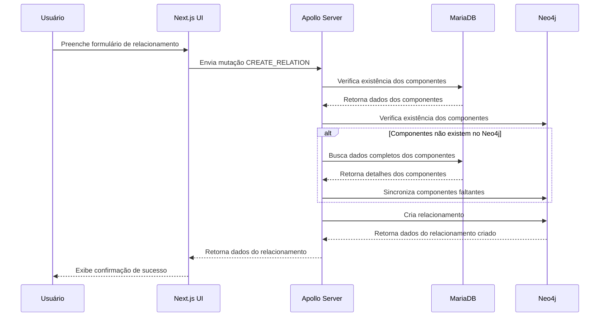

# Fluxo de Criação de Relacionamentos no Beaver

Este documento detalha o fluxo completo de dados para a criação de relacionamentos entre componentes no sistema Beaver.

## Visão Geral

O processo de criação de relacionamentos envolve múltiplas camadas do sistema:

1. **Interface do Usuário**: Onde o usuário preenche um formulário com os dados do relacionamento
2. **Comunicação GraphQL**: Que transmite os dados para o backend através da mutação `CREATE_RELATION`
3. **Backend (API)**: Onde o resolver processa a requisição e realiza as operações necessárias
4. **Banco de Dados**: Onde o relacionamento é persistido no Neo4j

## Fluxograma



## Detalhamento das Etapas

### 1. Interface do Usuário

Na interface, o usuário utiliza um formulário para criar o relacionamento, onde preenche:

- **Componente de Origem**: O componente que será a origem do relacionamento
- **Componente de Destino**: O componente que será o destino do relacionamento
- **Tipo de Relacionamento**: A natureza da relação entre os componentes (ex: DEPENDS_ON, CONNECTS_TO)
- **Descrição**: Explicação opcional sobre o relacionamento

O formulário realiza validações básicas:
- Verifica se todos os campos obrigatórios foram preenchidos
- Garante que origem e destino não são o mesmo componente

### 2. Comunicação GraphQL

Quando o usuário submete o formulário, o frontend envia uma mutação GraphQL `CREATE_RELATION` para a API:

```graphql
mutation CreateRelation($input: RelationInput!) {
  createRelation(input: $input) {
    id
    sourceId
    targetId
    type
    properties
    source {
      name
    }
    target {
      name
    }
    createdAt
    updatedAt
  }
}
```

Onde `RelationInput` contém:
```graphql
{
  sourceId: number;
  targetId: number;
  type: string;
  properties: {
    description: string;
  }
}
```

### 3. Backend Processing

O resolver `createRelation` no backend processa a requisição através dos seguintes passos:

1. **Verificação de Componentes no MariaDB**:
   - Busca os componentes de origem e destino no banco de dados principal (MariaDB)
   - Verifica se ambos existem e são ativos

2. **Verificação de Componentes no Neo4j**:
   - Verifica se os componentes de origem e destino existem no Neo4j usando a query Cypher:
   ```cypher
   MATCH (source:Component {id: $sourceId})
   MATCH (target:Component {id: $targetId})
   RETURN count(source) > 0 AND count(target) > 0 as exist
   ```
   - Se o resultado for `false`, identifica quais componentes específicos estão faltando:
     ```cypher
     MATCH (source:Component {id: $sourceId})
     RETURN count(source) > 0 as exist
     ```
     ```cypher
     MATCH (target:Component {id: $targetId})
     RETURN count(target) > 0 as exist
     ```
   - Para os componentes não encontrados no Neo4j, busca seus dados completos no MariaDB:
     ```sql
     SELECT id, name, description 
     FROM Component 
     WHERE id IN ($sourceId, $targetId)
     ```
   - Cria os componentes faltantes no Neo4j usando MERGE para evitar duplicação:
     ```cypher
     MERGE (c:Component {id: $id})
     ON CREATE SET 
       c.name = $name,
       c.description = $description,
       c.valid_from = datetime(),
       c.valid_to = datetime('9999-12-31T23:59:59Z')
     RETURN c
     ```
   - Registra no log todas as etapas da sincronização

3. **Criação do Relacionamento**:
   - Após garantir que ambos os componentes existem no Neo4j, cria o relacionamento:
   ```cypher
   MATCH (source:Component {id: $sourceId})
   MATCH (target:Component {id: $targetId})
   CREATE (source)-[r:${type} {properties: $properties, createdAt: $now, updatedAt: $now}]->(target)
   RETURN r
   ```

4. **Retorno dos Dados**:
   - Converte os dados retornados pelo Neo4j em um objeto compatível com GraphQL
   - Retorna o objeto para o frontend

### 4. Tipos de Relacionamentos Suportados

O sistema suporta diversos tipos de relacionamentos entre componentes:

| Tipo              | Descrição                                             |
|-------------------|-------------------------------------------------------|
| CONNECTS_TO       | Indica que um componente se conecta a outro           |
| DEPENDS_ON        | Indica que um componente depende de outro             |
| PROVIDES_DATA_TO  | Indica que um componente fornece dados para outro     |
| CONSUMES_DATA_FROM| Indica que um componente consome dados de outro       |
| CALLS             | Indica que um componente chama outro                  |
| EXTENDS           | Indica que um componente estende outro                |
| IMPLEMENTS        | Indica que um componente implementa outro             |
| PROTECTS          | Indica que um componente protege outro                |
| MONITORS          | Indica que um componente monitora outro               |
| STORES_DATA_IN    | Indica que um componente armazena dados em outro      |

## Sincronização entre MariaDB e Neo4j

Para garantir a integridade referencial e que todos os componentes estejam corretamente sincronizados entre o banco de dados principal (MariaDB) e o banco de grafos (Neo4j), o sistema implementa:

1. **Verificação Automática**: Durante a criação e atualização de relacionamentos, o sistema executa uma verificação em duas etapas:
   - Primeiro verifica se os componentes existem no MariaDB (fonte principal)
   - Em seguida, verifica se os mesmos componentes existem no Neo4j

2. **Sincronização sob Demanda**: O fluxo de sincronização é acionado automaticamente quando:
   - Um componente existe no MariaDB mas não no Neo4j
   - O sistema precisa identificar qual componente específico está faltando (origem, destino ou ambos)
   - Os dados completos dos componentes faltantes são recuperados do MariaDB
   - Os componentes são criados no Neo4j com todos os atributos necessários

3. **Scripts de Manutenção**: Além da sincronização automática durante o fluxo de criação, existem scripts auxiliares para:
   - `sync-components.ts`: Sincroniza todos os componentes do MariaDB para o Neo4j
   - `fix-relationships.ts`: Identifica e corrige relacionamentos problemáticos no Neo4j, como:
     - Relacionamentos órfãos (onde origem ou destino não existem)
     - Componentes isolados (sem relacionamentos)
     - Relacionamentos com IDs específicos que possam estar causando problemas

## Manuseio de Erros

O sistema implementa tratamento de erros em múltiplos níveis:

1. **Validação no Frontend**:
   - Campos obrigatórios não preenchidos
   - Seleção do mesmo componente como origem e destino

2. **Validação no Backend**:
   - Componentes inexistentes no MariaDB
   - Falha ao criar relacionamento no Neo4j
   - Falha ao sincronizar componentes entre bancos

3. **Feedback ao Usuário**:
   - Mensagens claras sobre erros ocorridos
   - Log detalhado de operações para troubleshooting 