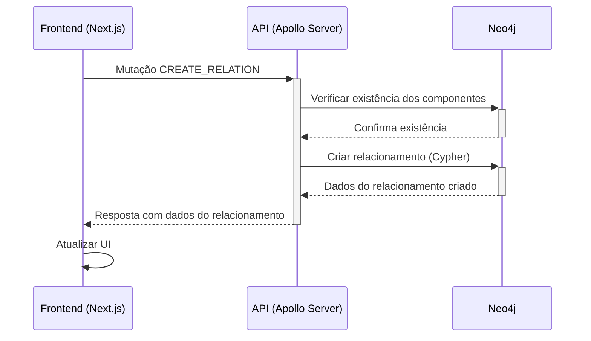

# Fluxo de Criação de Relacionamento

## Visão Geral

Este documento descreve o fluxo completo de dados para criar relacionamentos entre componentes no sistema Beaver.



## Detalhes do Fluxo

### 1. Interface do Usuário

O usuário interage com o formulário de criação de relacionamento, preenchendo:

- **Componente de Origem**: O componente de onde parte o relacionamento
- **Componente de Destino**: O componente para onde o relacionamento aponta
- **Tipo de Relacionamento**: A natureza do relacionamento (ex: CONNECTS_TO, DEPENDS_ON)
- **Descrição** (opcional): Uma descrição textual do relacionamento

O formulário realiza as seguintes validações:
- Ambos os componentes devem ser selecionados
- Os componentes de origem e destino não podem ser o mesmo
- O tipo de relacionamento deve ser selecionado

### 2. Comunicação GraphQL

Após validação do formulário, uma mutação GraphQL é enviada para a API:

```graphql
mutation CreateRelation($input: RelationInput!) {
  createRelation(input: $input) {
    id
    sourceId
    targetId
    type
    properties
  }
}
```

Com o formato de entrada:

```typescript
interface RelationInput {
  sourceId: number;
  targetId: number;
  type: string;
  properties?: Record<string, any>; // Inclui descrição
}
```

### 3. Processamento no Backend

O resolver `createRelation` no servidor GraphQL processa a mutação:

```typescript
// Mutation para criar um novo relacionamento
builder.mutationField('createRelation', (t) =>
  t.field({
    type: RelationType,
    args: {
      input: t.arg({
        type: 'RelationInput',
        required: true,
      }),
    },
    resolve: async (_, { input }) => {
      try {
        // Verificar se os componentes existem no Neo4j
        const existInNeo4j = await neo4jClient.run(`
          MATCH (source:Component {id: $sourceId})
          MATCH (target:Component {id: $targetId})
          RETURN count(source) > 0 AND count(target) > 0 as exist
        `, { sourceId: input.sourceId, targetId: input.targetId });

        if (!existInNeo4j.records[0].get('exist')) {
          throw new Error('Componente não encontrado no Neo4j');
        }
        
        // Criar relacionamento no Neo4j
        const result = await neo4jClient.createRelation(
          input.sourceId,
          input.targetId,
          input.type,
          input.properties || {}
        );
        
        logger.info(`Relacionamento criado: ${input.sourceId} -> ${input.targetId}`);
        return result;
      } catch (error) {
        logger.error('Erro ao criar relacionamento:', error);
        throw error;
      }
    },
  })
);
```

#### 3.1 Verificação no Neo4j

> **IMPORTANTE**: Antes de criar o relacionamento, o sistema verifica se ambos os componentes (origem e destino) existem no Neo4j usando uma consulta Cypher. Isso garante a integridade referencial e evita a criação de relacionamentos com componentes inexistentes.

A consulta verifica a existência dos nós com os IDs correspondentes:

```cypher
MATCH (source:Component {id: $sourceId})
MATCH (target:Component {id: $targetId})
RETURN count(source) > 0 AND count(target) > 0 as exist
```

Se a consulta retornar `false`, o sistema lança um erro indicando que um ou ambos os componentes não foram encontrados no Neo4j.

#### 3.2 Criação do Relacionamento

Se ambos os componentes forem encontrados, o sistema prossegue com a criação do relacionamento usando o método `createRelation` do cliente Neo4j:

```typescript
// Implementação do método createRelation no Neo4jClient
async createRelation(
  sourceId: number,
  targetId: number,
  type: string,
  properties: any = {}
): Promise<IRelation> {
  const session = this.driver.session();
  try {
    const now = new Date().toISOString();
    const result = await session.run(`
      MATCH (source:Component {id: $sourceId})
      MATCH (target:Component {id: $targetId})
      CREATE (source)-[r:${type} {properties: $properties, createdAt: $now, updatedAt: $now}]->(target)
      RETURN 
        toString(id(r)) AS id, 
        type(r) AS type, 
        source.id AS sourceId, 
        target.id AS targetId,
        r.properties AS properties,
        r.createdAt AS createdAt,
        r.updatedAt AS updatedAt
    `, { sourceId, targetId, properties, now });

    if (result.records.length === 0) {
      throw new Error('Falha ao criar relacionamento');
    }

    const record = result.records[0];
    // Processar e retornar o resultado
    return {
      id: record.get('id'),
      type: record.get('type'),
      sourceId: typeof record.get('sourceId') === 'number' ? record.get('sourceId') : parseInt(record.get('sourceId')),
      targetId: typeof record.get('targetId') === 'number' ? record.get('targetId') : parseInt(record.get('targetId')),
      properties,
      createdAt: new Date(now),
      updatedAt: new Date(now)
    };
  } catch (error) {
    logger.error('Erro ao criar relacionamento:', error);
    throw error;
  } finally {
    await session.close();
  }
}
```

### 4. Resposta e Atualização da UI

Após o processamento bem-sucedido:

1. A API retorna os dados do relacionamento criado
2. O frontend atualiza a UI, mostrando o novo relacionamento na lista ou grafo
3. Se ocorrer um erro, o sistema exibe uma mensagem apropriada ao usuário

## Tipos de Relacionamento Suportados

O sistema suporta os seguintes tipos de relacionamento:

- `CONNECTS_TO`: Indica uma conexão direta entre componentes
- `DEPENDS_ON`: Indica uma dependência de um componente para outro
- `PART_OF`: Indica que um componente é parte de outro
- `COMMUNICATES_WITH`: Indica comunicação entre componentes
- `RELATED_TO`: Relacionamento genérico entre componentes

## Considerações de Segurança e Desempenho

- A verificação da existência dos componentes no Neo4j é crucial para manter a integridade do grafo
- As consultas Cypher são parametrizadas para evitar injeção
- O sistema usa sessões isoladas para cada operação, garantindo atomicidade
- Log de todas as operações para auditoria e depuração 

## Requisitos e Boas Práticas para Criação de Relacionamentos no Neo4j

Para garantir a integridade e a eficiência na criação de relacionamentos no Neo4j, o sistema Beaver implementa os seguintes requisitos e boas práticas:

### 1. Existência Prévia dos Nós

- **Requisito**: Os nós de origem e destino devem existir antes da criação do relacionamento
- **Implementação**: O sistema utiliza a cláusula `MATCH` para verificar a existência dos componentes antes de criar a relação:
  ```cypher
  MATCH (source:Component {id: $sourceId})
  MATCH (target:Component {id: $targetId})
  ```
- **Validação**: Se algum dos nós não existir, o sistema retorna um erro antes de tentar criar o relacionamento

### 2. Direção Explícita do Relacionamento

- **Requisito**: Todo relacionamento deve ter uma direção definida (origem → destino)
- **Implementação**: A sintaxe Cypher utilizada no sistema define claramente a direção:
  ```cypher
  CREATE (source)-[r:${type}]->(target)
  ```
- **Contexto**: A direção é semanticamente importante na arquitetura, indicando fluxo de dados, dependência ou composição

### 3. Tipo de Relacionamento Obrigatório

- **Requisito**: Todo relacionamento deve ter um tipo que descreve sua natureza
- **Implementação**: O tipo é especificado como parâmetro obrigatório na API e utiliza convenção de nomes em CAIXA ALTA:
  ```typescript
  type: string; // Obrigatório no RelationInput
  ```
- **Validação**: O formulário de UI e o schema GraphQL garantem que o tipo seja fornecido

### 4. Propriedades Opcionais nos Relacionamentos

- **Requisito**: Relacionamentos podem (opcionalmente) conter metadados adicionais
- **Implementação**: O sistema permite a adição de propriedades como descrição, datas e metadados:
  ```cypher
  CREATE (source)-[r:${type} {properties: $properties, createdAt: $now, updatedAt: $now}]->(target)
  ```
- **Padrão**: Todo relacionamento recebe automaticamente timestamps de criação e atualização

### 5. Prevenção de Relacionamentos Duplicados

- **Recomendação**: Evitar a criação de múltiplos relacionamentos idênticos entre os mesmos nós
- **Estratégia futura**: Implementar verificação de unicidade ou uso de `MERGE` em vez de `CREATE`:
  ```cypher
  // Exemplo de implementação futura para evitar duplicação
  MERGE (source:Component {id: $sourceId})
  MERGE (target:Component {id: $targetId})
  MERGE (source)-[r:${type}]->(target)
  ON CREATE SET r.properties = $properties, r.createdAt = $now, r.updatedAt = $now
  ON MATCH SET r.properties = $properties, r.updatedAt = $now
  ```

### 6. Índices e Constraints

- **Recomendação**: Usar índices para otimizar a busca de componentes e constraints para garantir unicidade
- **Implementação**: O sistema define índices nos IDs dos componentes para acelerar a localização:
  ```cypher
  // Exemplo de criação de índice (executado na inicialização do banco)
  CREATE INDEX ON :Component(id)
  ```

### 7. Permissões de Acesso

- **Requisito**: Usuários precisam ter permissões adequadas para criar relacionamentos
- **Implementação**: O sistema utiliza autenticação JWT e verifica permissões antes de permitir operações de criação
- **Controle**: Apenas usuários autenticados com papel "admin" ou "architect" podem criar relacionamentos

### Considerações Adicionais

- A implementação atual usa IDs do tipo `string` para lidar com IDs grandes do Neo4j, evitando limitações de inteiros de 32 bits
- Todas as operações são registradas em logs para fins de auditoria e depuração
- Validações adicionais no frontend evitam tentativas de criação de relacionamentos inválidos antes de atingirem a API 