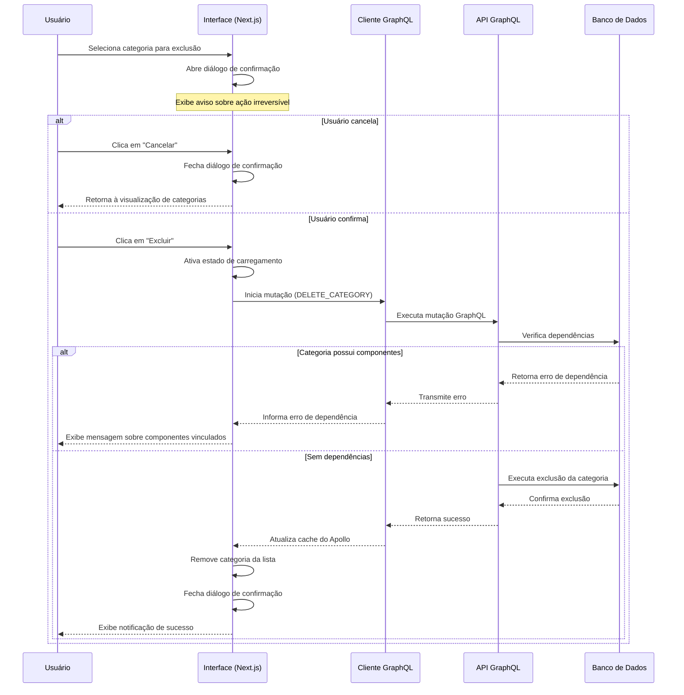

# Fluxo de Exclusão de Categorias

Este documento detalha o fluxo de exclusão de categorias na aplicação Beaver, incluindo a interação entre o frontend e o backend, validações, confirmações e tratamento de dependências.

## Diagrama de Fluxo



## Fluxo Detalhado

### 1. Inicialização da Operação de Exclusão

1. **Acesso à Opção de Exclusão**
   - O usuário pode iniciar a exclusão de uma categoria de duas formas:
     - Clicando no botão de exclusão (ícone de lixeira) no modal de detalhes da categoria
     - Clicando no menu de contexto (três pontos) no card da categoria e selecionando "Excluir"

2. **Verificação de Permissões**
   - O sistema verifica se o usuário possui permissões para excluir categorias
   - Apenas usuários com papel "admin" podem realizar esta operação
   - Botões de exclusão são ocultados para usuários sem permissões adequadas

### 2. Confirmação de Exclusão

1. **Exibição do Diálogo de Confirmação**
   - Um diálogo modal é aberto contendo:
     - Título claro: "Excluir Categoria"
     - Mensagem de aviso: "Esta ação não pode ser desfeita"
     - Nome da categoria a ser excluída
     - Botões "Cancelar" e "Excluir"
   - O botão "Excluir" é destacado em vermelho para indicar ação destrutiva
   - O botão "Cancelar" é posicionado à esquerda, seguindo padrões de interface

2. **Decisão do Usuário**
   - Caso o usuário clique em "Cancelar":
     - O diálogo é fechado
     - Nenhuma alteração é realizada
     - O usuário retorna à visualização anterior
   - Caso o usuário clique em "Excluir":
     - O sistema prossegue com a operação de exclusão
     - O botão entra em estado de carregamento para feedback visual
     - O diálogo permanece aberto até a conclusão da operação

### 3. Processamento da Exclusão

1. **Chamada à API GraphQL**
   - Uma mutação GraphQL `deleteCategory` é iniciada via Apollo Client:
   ```javascript
   const [deleteCategory, { loading: deleteLoading }] = useMutation(DELETE_CATEGORY, {
     onCompleted: () => {
       // Tratamento de sucesso
       setDeleteDialogOpen(false);
       toast.success("Categoria excluída com sucesso");
     },
     onError: (error) => {
       // Tratamento de erro
       toast.error(`Erro ao excluir categoria: ${error.message}`);
     },
     update: (cache, { data }) => {
       // Atualização do cache do Apollo
       if (data?.deleteCategory) {
         cache.modify({
           fields: {
             categories(existingCategories = [], { readField }) {
               return existingCategories.filter(
                 categoryRef => readField('id', categoryRef) !== currentCategory.id
               );
             }
           }
         });
       }
     }
   });
   ```

2. **Processamento no Backend**
   - O resolver `deleteCategory` no `categoryResolvers.ts` processa a requisição:
   ```typescript
   deleteCategory: builder.mutationField('deleteCategory', {
     type: 'Category',
     args: {
       id: builder.arg({ type: 'ID', required: true })
     },
     resolve: async (root, { id }, ctx) => {
       // Verificação de autenticação
       if (!ctx.user || ctx.user.role !== 'admin') {
         throw new Error('Não autorizado');
       }

       // Verificação de dependências
       const componentsCount = await ctx.prisma.component.count({
         where: { categoryId: parseInt(id) }
       });

       if (componentsCount > 0) {
         throw new Error('Esta categoria possui componentes vinculados e não pode ser excluída');
       }

       // Execução da exclusão
       try {
         const deletedCategory = await ctx.prisma.category.delete({
           where: { id: parseInt(id) }
         });
         
         // Registro da operação no log do sistema
         await ctx.prisma.log.create({
           data: {
             userId: ctx.user.id,
             action: `Categoria "${deletedCategory.name}" excluída`
           }
         });
         
         return deletedCategory;
       } catch (error) {
         console.error('Erro ao excluir categoria:', error);
         throw new Error('Falha ao excluir categoria');
       }
     }
   })
   ```

3. **Validações de Dependência**
   - Verificação de componentes vinculados à categoria
   - A exclusão é bloqueada se houver componentes associados
   - O usuário é informado sobre a necessidade de remover a associação dos componentes antes de excluir a categoria

### 4. Finalização da Operação

1. **Tratamento de Sucesso**
   - O diálogo de confirmação é fechado
   - A categoria é removida da lista na interface (sem recarregar a página)
   - Uma notificação de sucesso é exibida temporariamente
   - O usuário continua na página de categorias

2. **Tratamento de Erros**
   - Em caso de falha na operação, o diálogo permanece aberto
   - Uma mensagem de erro específica é exibida:
     - "Esta categoria possui componentes vinculados" (erro de dependência)
     - "Não autorizado" (erro de permissão)
     - "Falha ao excluir categoria" (erro genérico)
   - O botão "Excluir" retorna ao estado normal para permitir nova tentativa ou cancelamento

## Tratamento de Casos Especiais

### 1. Exclusão de Categoria com Componentes

- Verificação prévia de componentes associados à categoria
- Bloqueio da exclusão se houver dependências
- Mensagem clara sobre a necessidade de desvincular os componentes
- Sugestão para editar os componentes ou alterar sua categoria

### 2. Falha de Conexão Durante Exclusão

- Timeout configurado para a operação (10 segundos)
- Tratamento de erro em caso de falha de conexão
- Opção de tentar novamente após restauração da conexão
- Estado da interface retorna ao normal após timeout

### 3. Exclusões em Massa (Administrativo)

- Funcionalidade disponível apenas para administradores
- Interface específica para seleção múltipla de categorias
- Confirmação única para todas as categorias selecionadas
- Validação individual de dependências para cada categoria
- Relatório detalhado de sucessos e falhas após a operação

## Componentes Envolvidos

### Frontend (Next.js/React)
- **src/app/categories/page.tsx**: Componente principal com lógica de interface e diálogos
- **src/lib/graphql.ts**: Definição da mutação `DELETE_CATEGORY`
- **components/ui/dialog.tsx**: Componente de diálogo reutilizável para confirmação

### Backend (Apollo Server/Pothos GraphQL/Prisma)
- **api/src/resolvers/categoryResolvers.ts**: Resolver para a mutação `deleteCategory`
- **api/src/prisma.ts**: Cliente Prisma para acesso ao banco de dados
- **api/prisma/schema.prisma**: Definição do modelo `Category` e suas relações

## Mutação GraphQL

```graphql
# Mutação para excluir uma categoria
mutation DeleteCategory($id: ID!) {
  deleteCategory(id: $id) {
    id
    name
  }
}
```

## Considerações de Segurança e Usabilidade

1. **Prevenção de Exclusão Acidental**
   - Diálogo de confirmação obrigatório
   - Distinção clara entre ações destrutivas e não-destrutivas
   - Posicionamento consistente dos botões em todos os diálogos de confirmação
   - Validação de dependências antes da exclusão

2. **Feedback ao Usuário**
   - Indicadores visuais durante o processamento
   - Mensagens claras sobre o resultado da operação
   - Notificações temporárias não-intrusivas
   - Detalhamento específico em caso de falhas

3. **Controle de Acesso**
   - Restrição da funcionalidade a usuários com papel "admin"
   - Ocultação de opções de exclusão para usuários sem permissão
   - Validação tanto no frontend quanto no backend

4. **Registro de Atividades**
   - Todas as exclusões são registradas na tabela de logs
   - Registro inclui usuário, data/hora e nome da categoria excluída
   - Registros são acessíveis via painel administrativo

## Notas de Implementação

- A interface segue as diretrizes estabelecidas no `dev_guide_en_us.md` para operações de exclusão
- O sistema implementa verificações em duas camadas (frontend e backend) para máxima segurança
- A operação é tratada como assíncrona para melhor experiência do usuário
- A atualização da interface ocorre sem recarregamento completo da página para melhor desempenho
- A exclusão de categoria é uma operação permanente, sem funcionalidade de "desfazer" 