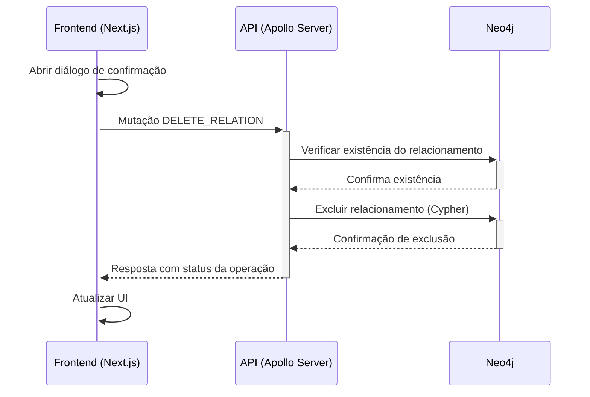

# Fluxo de Exclusão de Relacionamento

## Visão Geral

Este documento descreve o fluxo completo de dados para excluir relacionamentos entre componentes no sistema Beaver.



## Detalhes do Fluxo

### 1. Interface do Usuário

O usuário pode iniciar a exclusão de um relacionamento de duas formas:

- **Na página de listagem de relacionamentos**: Através do botão de exclusão disponível em cada card de relacionamento
- **Na página de detalhes do relacionamento**: Através do botão "Excluir" no modal de detalhes

Em ambos os casos, um diálogo de confirmação é exibido ao usuário solicitando a confirmação antes de prosseguir com a exclusão:

```typescript
// Modal de confirmação de exclusão
<Dialog open={showDeleteConfirm} onOpenChange={setShowDeleteConfirm}>
  <DialogContent className="sm:max-w-md">
    <DialogHeader>
      <DialogTitle>Confirmar Exclusão</DialogTitle>
      <DialogDescription className="pt-2">
        Tem certeza de que deseja excluir este relacionamento? Esta ação não pode ser desfeita.
      </DialogDescription>
    </DialogHeader>
    <DialogFooter className="flex justify-end gap-4 pt-4 mt-4 border-t">
      <Button variant="outline" onClick={() => setShowDeleteConfirm(false)}>
        Cancelar
      </Button>
      <Button variant="default" onClick={handleConfirmedDelete}>
        Excluir
      </Button>
    </DialogFooter>
  </DialogContent>
</Dialog>
```

### 2. Comunicação GraphQL

Após a confirmação do usuário, uma mutação GraphQL é enviada para a API:

```graphql
mutation DeleteRelation($id: String!) {
  deleteRelation(id: $id)
}
```

O único argumento necessário é o ID do relacionamento a ser excluído, que é utilizado para localizar e remover o relacionamento específico no Neo4j.

### 3. Processamento no Backend

O resolver `deleteRelation` no servidor GraphQL processa a mutação:

```typescript
// Mutation para excluir um relacionamento
builder.mutationField('deleteRelation', (t) =>
  t.field({
    type: 'Boolean',
    args: {
      id: t.arg.string({ required: true }),
    },
    resolve: async (_, { id }) => {
      try {
        // Verificar se o relacionamento existe
        const existingRelation = await neo4jClient.getRelationById(id);
        if (!existingRelation) {
          throw new Error(`Relacionamento com ID ${id} não encontrado`);
        }
        
        // Excluir relacionamento do Neo4j
        await neo4jClient.deleteRelation(id);
        
        logger.info(`Relacionamento excluído: ${id}`);
        return true;
      } catch (error) {
        logger.error(`Erro ao excluir relacionamento ${id}:`, error);
        throw error;
      }
    },
  })
);
```

#### 3.1 Verificação no Neo4j

> **IMPORTANTE**: Antes de excluir o relacionamento, o sistema verifica se o relacionamento existe no Neo4j. Essa verificação é essencial para confirmar que o relacionamento realmente existe e para evitar erros no processo de exclusão.

O método `getRelationById` é utilizado para buscar o relacionamento no Neo4j:

```typescript
async getRelationById(id: string | number): Promise<IRelation | null> {
  // Implementação do método para buscar um relacionamento por ID
  // ...
}
```

Se o relacionamento não for encontrado, o sistema lança um erro indicando que o relacionamento não existe.

#### 3.2 Exclusão do Relacionamento

Se o relacionamento for encontrado, o sistema procede com a exclusão usando o método `deleteRelation` do cliente Neo4j:

```typescript
// Excluir um relacionamento
async deleteRelation(id: number | string): Promise<boolean> {
  const session = this.driver.session();
  try {
    const result = await session.run(`
      MATCH ()-[r]->()
      WHERE id(r) = $id
      DELETE r
      RETURN count(r) as count
    `, { id });

    return result.records[0].get('count').toNumber() > 0;
  } catch (error) {
    logger.error(`Erro ao excluir relacionamento ${id}:`, error);
    throw error;
  } finally {
    await session.close();
  }
}
```

A consulta Cypher busca qualquer relacionamento com o ID específico e o exclui. A operação retorna a contagem de relacionamentos excluídos, que deve ser 1 para uma exclusão bem-sucedida.

### 4. Resposta e Atualização da UI

Após o processamento bem-sucedido:

1. A API retorna `true` indicando que a exclusão foi realizada com sucesso
2. O frontend fecha o diálogo de confirmação e atualiza a lista de relacionamentos:

```typescript
// Função para excluir relacionamento após confirmação
const handleConfirmedDelete = () => {
  if (relationshipToDelete === null) return;
  
  deleteRelation({
    variables: { id: relationshipToDelete },
    onCompleted: () => {
      setShowDeleteConfirm(false);
      setRelationshipToDelete(null);
      setTimeout(() => refetch(), 300);
    }
  });
};
```

3. A chamada `refetch()` busca a lista atualizada de relacionamentos do servidor para refletir a mudança

### 5. Tratamento de Erros

Se ocorrer um erro durante o processo de exclusão:

1. O servidor registra o erro nos logs
2. O erro é propagado para o cliente
3. O frontend exibe uma mensagem de erro apropriada para o usuário
4. Nenhuma alteração é feita no banco de dados

## Considerações de Segurança e Desempenho

- A verificação da existência do relacionamento antes da exclusão é crucial para evitar comportamentos inesperados
- A consulta Cypher é parametrizada para evitar injeção
- O sistema usa sessões isoladas para cada operação, garantindo atomicidade
- Log de todas as operações para auditoria e depuração
- A confirmação do usuário antes da exclusão evita exclusões acidentais

## Requisitos para Exclusão de Relacionamentos no Neo4j

Para garantir a integridade e segurança na exclusão de relacionamentos no Neo4j, o sistema Beaver implementa os seguintes requisitos:

### 1. Identificação Única

- **Requisito**: Cada relacionamento deve ter um identificador único
- **Implementação**: O sistema utiliza o ID interno do Neo4j para identificar relacionamentos:
  ```cypher
  MATCH ()-[r]->()
  WHERE id(r) = $id
  ```
- **Garantia**: Isso assegura que apenas o relacionamento específico será afetado

### 2. Verificação Prévia

- **Requisito**: Confirmar a existência do relacionamento antes de tentar a exclusão
- **Implementação**: Uma consulta é realizada para verificar se o relacionamento existe:
  ```typescript
  const existingRelation = await neo4jClient.getRelationById(id);
  ```
- **Benefício**: Evita tentativas de exclusão de relacionamentos inexistentes e fornece feedback mais preciso ao usuário

### 3. Atomicidade

- **Requisito**: A operação de exclusão deve ser atômica - ou é completamente bem-sucedida ou falha completamente
- **Implementação**: O uso de sessões isoladas e transações implícitas do Neo4j:
  ```typescript
  const session = this.driver.session();
  try {
    // Operação de exclusão
  } finally {
    await session.close();
  }
  ```
- **Garantia**: Mesmo em caso de falha, o banco de dados permanece em um estado consistente

### 4. Confirmação de Exclusão

- **Requisito**: Confirmar que a exclusão foi realmente concluída
- **Implementação**: A consulta retorna a contagem de relacionamentos excluídos:
  ```cypher
  DELETE r
  RETURN count(r) as count
  ```
- **Verificação**: O sistema confirma que pelo menos um relacionamento foi excluído

### 5. Controle de Acesso

- **Requisito**: Apenas usuários autorizados podem excluir relacionamentos
- **Implementação**: O sistema utiliza o mecanismo de autenticação e autorização do GraphQL para garantir que apenas usuários com as permissões adequadas possam executar a mutação de exclusão

## Impacto no Sistema

A exclusão de relacionamentos não afeta diretamente os componentes (nós) no grafo, apenas remove a conexão entre eles. Isso significa que:

1. Os componentes permanecem intactos no banco de dados
2. Outras relações entre os mesmos ou outros componentes não são afetadas
3. A integridade referencial é mantida no grafo

Não é necessário atualizar informações no MariaDB, pois os relacionamentos são mantidos exclusivamente no Neo4j. 