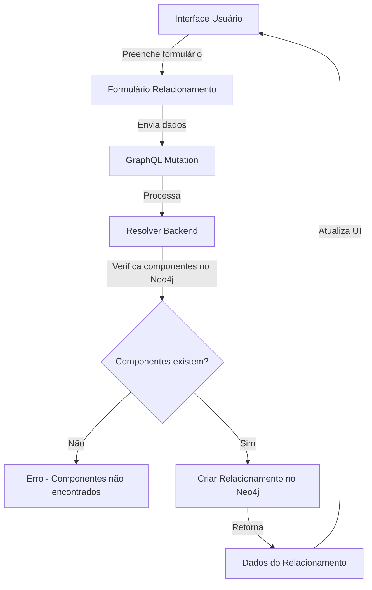

# Fluxo de Criação de Relacionamento

## Visão Geral

Este documento descreve o fluxo completo de dados para criação de relacionamentos entre componentes no sistema Beaver, desde a interface do usuário até a persistência no banco de dados Neo4j.



## Interface do Usuário

No frontend, o usuário preenche um formulário com os seguintes campos:

1. **Componente de origem** (obrigatório): Componente que será a origem do relacionamento.
2. **Componente de destino** (obrigatório): Componente que será o destino do relacionamento.
3. **Tipo de relacionamento** (obrigatório): O tipo de relacionamento entre os componentes.
4. **Descrição** (opcional): Uma descrição textual do relacionamento.

## Comunicação GraphQL

Após o preenchimento do formulário, a aplicação envia uma mutation GraphQL para o servidor:

```graphql
mutation CreateRelation($input: RelationInput!) {
  createRelation(input: $input) {
    id
    sourceId
    targetId
    type
    properties
    createdAt
    updatedAt
  }
}
```

Onde `RelationInput` contém:

```graphql
{
  sourceId: Int!
  targetId: Int!
  type: String!
  properties: JSON
}
```

## Processamento Backend

### 1. Resolver GraphQL

No backend, o resolver `createRelation` processa a requisição:

```typescript
// Mutation para criar um novo relacionamento
builder.mutationField('createRelation', (t) =>
  t.field({
    type: RelationType,
    args: {
      input: t.arg({
        type: 'RelationInput',
        required: true,
      }),
    },
    resolve: async (_, { input }) => {
      try {
        logger.info(`Iniciando criação de relacionamento: ${input.sourceId} -> ${input.targetId}`);
        
        // Verificar se os componentes existem no Neo4j
        const componentsExist = await neo4jClient.run(`
          MATCH (source:Component {id: $sourceId})
          MATCH (target:Component {id: $targetId})
          RETURN count(source) > 0 AS sourceExists, count(target) > 0 AS targetExists
        `, { sourceId: input.sourceId, targetId: input.targetId });
        
        const sourceExists = componentsExist.records[0]?.get('sourceExists');
        const targetExists = componentsExist.records[0]?.get('targetExists');
        
        // Se algum componente não existir no Neo4j, lançar erro
        if (!sourceExists || !targetExists) {
          logger.error(`Componentes não encontrados no Neo4j. SourceId: ${input.sourceId} existe: ${sourceExists}, TargetId: ${input.targetId} existe: ${targetExists}`);
          
          // Construir mensagem de erro detalhada
          const errorMsg = [];
          if (!sourceExists) errorMsg.push(`Componente de origem (ID: ${input.sourceId}) não existe no Neo4j`);
          if (!targetExists) errorMsg.push(`Componente de destino (ID: ${input.targetId}) não existe no Neo4j`);
          
          // Sugerir executar script de sincronização
          throw new Error(`${errorMsg.join('. ')}. Execute o script de sincronização para corrigir.`);
        }
        
        // Criar relacionamento no Neo4j
        const result = await neo4jClient.createRelation(
          input.sourceId,
          input.targetId,
          input.type,
          input.properties || {}
        );
        
        logger.info(`Relacionamento criado com sucesso: ${input.sourceId} -> ${input.targetId}`);
        return result;
      } catch (error) {
        logger.error(`Erro ao criar relacionamento:`, error);
        throw error;
      }
    },
  })
);
```

### 2. Verificação de Componentes no Neo4j

Um passo crítico no processo é a verificação de que ambos os componentes (origem e destino) existem no Neo4j antes de criar o relacionamento. O sistema:

1. Executa uma consulta Cypher para verificar se os componentes existem no Neo4j
2. Se qualquer um dos componentes não existir:
   - Registra um erro detalhado no log
   - Constrói uma mensagem de erro específica
   - Recomenda a execução do script de sincronização
   - Lança uma exceção, interrompendo o processo

Este passo de verificação é essencial para manter a integridade referencial no banco de dados de grafos, prevenindo a criação de relacionamentos "órfãos" (que apontam para componentes inexistentes).

### 3. Criação do Relacionamento no Neo4j

Se ambos os componentes existirem, o sistema procede com a criação do relacionamento:

```typescript
// No cliente Neo4j (neo4jClient.createRelation)
const session = this.driver.session();
try {
  // Criar relacionamento
  const result = await session.run(`
    MATCH (source:Component {id: $sourceId})
    MATCH (target:Component {id: $targetId})
    CREATE (source)-[r:${this.normalizeRelationType(type)} $props]->(target)
    SET r.id = randomUUID(),
        r.createdAt = datetime(),
        r.updatedAt = datetime()
    RETURN r.id AS id, $sourceId AS sourceId, $targetId AS targetId, type(r) AS type, r.createdAt as createdAt, r.updatedAt as updatedAt, $props as properties
  `, {
    sourceId,
    targetId,
    props: properties || {}
  });
  
  // Extrair e retornar dados do relacionamento criado
  const record = result.records[0];
  return {
    id: record.get('id'),
    sourceId: parseInt(record.get('sourceId')),
    targetId: parseInt(record.get('targetId')),
    type: record.get('type'),
    properties: record.get('properties'),
    createdAt: new Date(record.get('createdAt')),
    updatedAt: new Date(record.get('updatedAt')),
  };
} finally {
  await session.close();
}
```

### 4. Tipos de Relacionamentos Suportados

Os tipos de relacionamentos suportados pelo sistema incluem:

- `DEPENDS_ON`: Indica que um componente depende de outro
- `COMMUNICATES_WITH`: Indica comunicação entre componentes
- `PART_OF`: Indica que um componente é parte de outro
- `IMPLEMENTS`: Indica que um componente implementa outro
- `EXTENDS`: Indica que um componente estende outro

## Resposta para o Frontend

Após a criação do relacionamento, os dados completos são enviados de volta para o frontend, incluindo:

- ID único do relacionamento
- IDs dos componentes de origem e destino
- Tipo de relacionamento
- Propriedades adicionais
- Timestamps de criação e atualização

## Tratamento de Erros

Se ocorrer qualquer erro durante o processo, a mensagem detalhada é enviada para o frontend, permitindo que o usuário tome ações corretivas, como:

1. Escolher componentes diferentes
2. Executar o script de sincronização de componentes para garantir que todos os componentes existem no Neo4j
3. Verificar a consistência de dados entre MariaDB e Neo4j

## Considerações Adicionais

- O servidor mantém registros detalhados (logs) de todas as operações relacionadas à criação de relacionamentos
- Todos os erros são registrados com detalhes suficientes para depuração
- A verificação de componentes antes da criação do relacionamento é essencial para manter a integridade dos dados
- Script de sincronização (`fix-relationships.ts`) está disponível para corrigir inconsistências entre MariaDB e Neo4j 