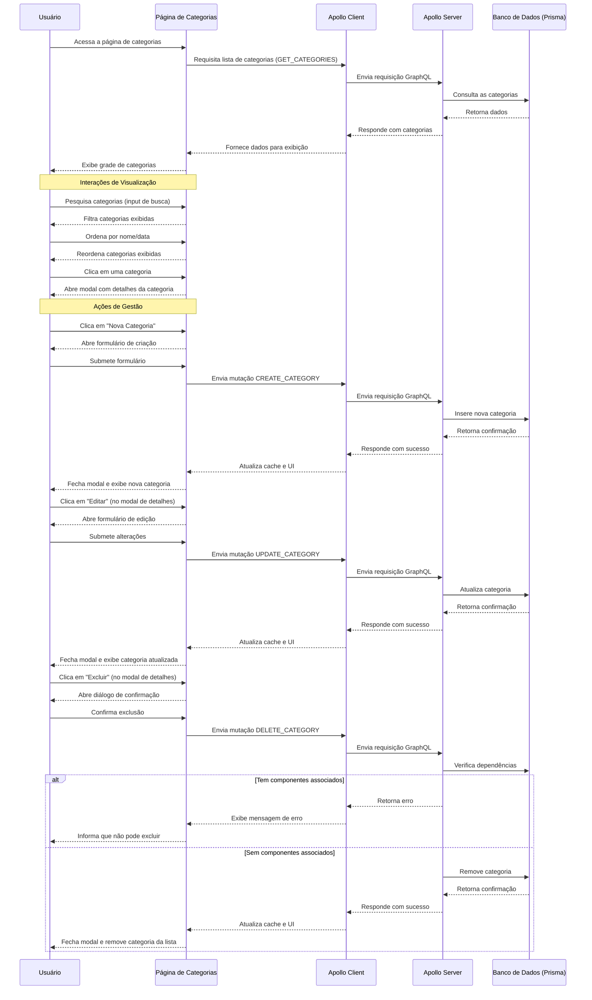

# Visualização e Gestão de Categorias no Beaver

## Diagrama de Fluxo



## Descrição Detalhada do Fluxo

### Inicialização e Carregamento de Dados

1. O usuário acessa a página de categorias (`/categories`)
2. O componente React `CategoriesPage` é renderizado e inicializa estados para diálogos, paginação e dados
3. Durante a montagem do componente, uma consulta GraphQL `GET_CATEGORIES` é executada
4. A consulta retorna todas as categorias com seus respectivos dados (id, nome, descrição, imagem, etc.)
5. Um estado de carregamento é exibido enquanto os dados estão sendo buscados
6. Após o recebimento dos dados, as categorias são exibidas em um layout de grade (grid)

### Visualização e Interação com a Lista

1. O usuário visualiza as categorias em um grid responsivo com cartões
2. Cada cartão exibe:
   - Nome da categoria
   - Imagem (se disponível)
   - Descrição resumida
   - Número de componentes associados
   - Data de criação
3. O usuário pode:
   - **Pesquisar categorias**: Filtrando por texto no nome ou descrição
   - **Ordenar categorias**: Por nome (alfabético) ou data de criação
   - **Rolar infinitamente**: Mais categorias são carregadas ao rolar até o final da página

### Visualização Detalhada de Categoria

1. Ao clicar em um cartão de categoria, um modal de detalhes é aberto
2. O modal exibe:
   - Cabeçalho com imagem e nome da categoria
   - Descrição completa
   - Detalhes técnicos (ID, data de criação)
   - Número de componentes associados
   - Botões de ação (Editar e Excluir)
3. O usuário pode fechar o modal clicando no botão de fechar ou fora do modal

### Ações e Manipulação de Dados

**Criação de Categoria:**
1. O usuário clica no botão "Nova Categoria" no topo da página
2. Um diálogo com o formulário de criação é aberto
3. O usuário preenche os campos obrigatórios (nome e descrição) e opcionalmente faz upload de uma imagem
4. Ao submeter o formulário, uma validação é realizada
5. Uma mutação GraphQL `CREATE_CATEGORY` é enviada ao servidor
6. Após sucesso, o cache do Apollo é atualizado e a nova categoria aparece na lista

**Edição de Categoria:**
1. No modal de detalhes, o usuário clica no botão "Editar"
2. Um diálogo com o formulário de edição é aberto, pré-preenchido com os dados atuais
3. O usuário altera os campos desejados
4. Ao submeter o formulário, uma validação é realizada
5. Uma mutação GraphQL `UPDATE_CATEGORY` é enviada ao servidor
6. Após sucesso, o cache do Apollo é atualizado e as alterações aparecem na lista

**Exclusão de Categoria:**
1. No modal de detalhes, o usuário clica no botão "Excluir"
2. Um diálogo de confirmação é aberto
3. Se a categoria possuir componentes associados, o botão de exclusão fica desabilitado
4. Ao confirmar a exclusão, uma mutação GraphQL `DELETE_CATEGORY` é enviada ao servidor
5. Após sucesso, o cache do Apollo é atualizado e a categoria é removida da lista

### Estados Especiais

1. **Estado de carregamento**: Um indicador de carregamento é exibido enquanto os dados estão sendo buscados
2. **Estado de erro**: Mensagens de erro são exibidas se houver falha nas requisições
3. **Lista vazia**: Uma mensagem indicando que não há categorias é exibida se a lista estiver vazia
4. **Carregamento infinito**: Um indicador de carregamento é exibido no final da lista enquanto mais dados estão sendo carregados

## Detalhes Técnicos

### Componentes Frontend (Next.js/React)

- **CategoriesPage** (`src/app/categories/page.tsx`): Componente principal que gerencia toda a lógica e estados
- **CategoryForm** (`src/app/categories/category-form.tsx`): Formulário reutilizável para criação e edição de categorias
- **Componentes UI**: Buttons, Dialog, Input, etc. da biblioteca shadcn/ui

### Backend (Apollo/Pothos/Prisma)

- **Resolvers** (`api/src/resolvers/categoryResolvers.ts`): Define as operações de CRUD para categorias
- **Modelo de Dados** (`api/prisma/schema.prisma`): Define o esquema da tabela Category no banco de dados

### Consulta GraphQL

```graphql
query GET_CATEGORIES {
  categories {
    id
    name
    description
    image
    createdAt
    components {
      id
    }
  }
}
```

### Considerações de Performance

1. **Paginação com rolagem infinita**: Garante carregamento eficiente mesmo com grande número de categorias
2. **Filtragem no cliente**: Pesquisa e ordenação realizadas no cliente para resposta rápida
3. **Otimização de imagens**: Imagens são limitadas em tamanho (máx. 2MB) e tipo (PNG, SVG)
4. **Cache do Apollo**: Utilizado para minimizar requisições ao servidor

Este documento detalha o fluxo completo de visualização e gestão de categorias no sistema Beaver, complementando a documentação existente sobre o fluxo de criação de categorias. 